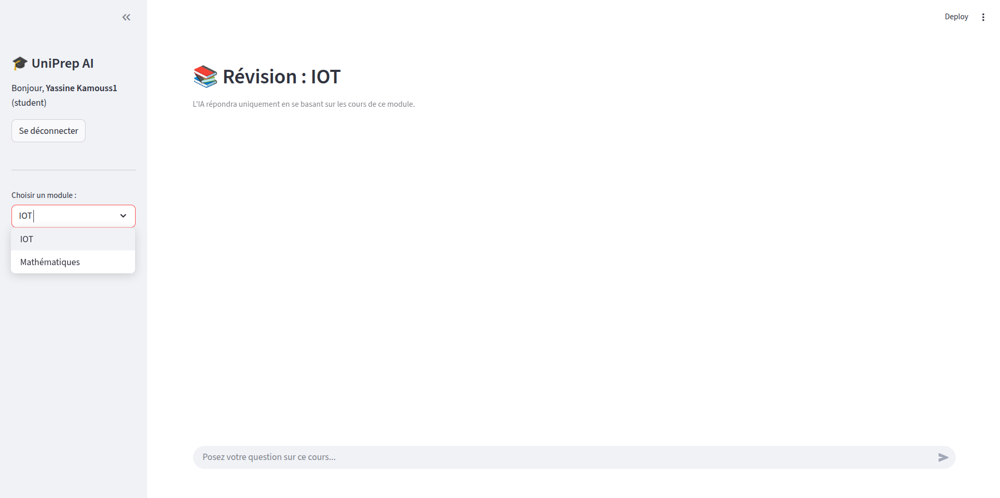

# 🎓 UniPrep AI



> **Votre assistant de révision intelligent propulsé par l'IA.**
> Discutez avec vos cours, révisez efficacement et maîtrisez vos modules.

---

## 📑 Table des Matières

- [À propos](#-à-propos)
- [Fonctionnalités Clés](#-fonctionnalités-clés)
- [Technologies Utilisées](#-technologies-utilisées)
- [Installation](#-installation)
- [Configuration](#-configuration)
- [Utilisation](#-utilisation)
- [Structure du Projet](#-structure-du-projet)
- [Contribuer](#-contribuer)

---

## 📖 À propos

**UniPrep AI** est une application web conçue pour révolutionner la façon dont les étudiants révisent. En utilisant la puissance des **LLMs (Large Language Models)** et la technique **RAG (Retrieval-Augmented Generation)**, l'application permet aux étudiants d'interagir directement avec le contenu de leurs cours au format PDF.

Fini la recherche interminable dans des centaines de pages : posez une question, et l'IA vous répond en citant précisément les passages pertinents de vos cours.

## 🚀 Fonctionnalités Clés

### 🔐 Authentification & Rôles
- **Système sécurisé** : Inscription et connexion avec hachage des mots de passe (bcrypt).
- **Rôle Étudiant** : Accès aux modules de révision et au chat intelligent.
- **Rôle Admin** : Gestion des modules et upload des ressources pédagogiques.

### 🧠 Moteur RAG Avancé
- **Indexation intelligente** : Découpage et vectorisation des PDF pour une recherche sémantique précise.
- **Embeddings Locaux** : Utilisation de `sentence-transformers` pour une rapidité et une confidentialité accrues (pas de dépendance API pour l'embedding).
- **Réponses Contextuelles** : L'IA (Google Gemini 2.0 Flash) génère des réponses basées *uniquement* sur le contenu du cours, évitant les hallucinations.

### ⚡ Performance & UX
- **Traitement par lots** : Gestion optimisée des gros fichiers PDF pour respecter les quotas API.
- **Interface Moderne** : UI intuitive et réactive construite avec Streamlit.
- **Historique de Chat** : Conservez le fil de votre conversation pour une révision fluide.

## 🛠 Technologies Utilisées

Ce projet repose sur une stack technique moderne et robuste 100% Python :

| Catégorie | Technologie | Description |
| :--- | :--- | :--- |
| **Frontend** |  | Framework pour l'interface utilisateur web. |
| **LLM** |  | Modèle de langage pour la génération de réponses (`gemini-2.0-flash`). |
| **RAG & Orchestration** |  | Framework pour l'orchestration du RAG. |
| **Base de Données Vectorielle** |  | Stockage des embeddings pour la recherche sémantique. |
| **Base de Données Relationnelle** |  | Gestion des utilisateurs et des métadonnées des modules. |
| **Embeddings** |  | Modèle local `all-MiniLM-L6-v2` via `sentence-transformers`. |
| **Sécurité** | `bcrypt` | Hachage sécurisé des mots de passe. |

## ⚙️ Installation

Prérequis : Python 3.10+ installé.

1.  **Cloner le dépôt**
    ```bash
    git clone https://github.com/yassinekamouss/CourseMate-AI.git
    cd CourseMate-AI
    ```

2.  **Créer un environnement virtuel**
    ```bash
    python3 -m venv env
    source env/bin/activate  # Linux/Mac
    # env\Scripts\activate   # Windows
    ```

3.  **Installer les dépendances**
    ```bash
    pip install -r requirements.txt
    ```

## 🔧 Configuration

1.  Obtenez une clé API Google Gemini sur [Google AI Studio](https://aistudio.google.com/).
2.  Créez un fichier `.env` à la racine du projet :
    ```env
    GOOGLE_API_KEY=votre_clé_api_ici
    ```

## ▶️ Utilisation

1.  **Lancer l'application**
    ```bash
    streamlit run app.py
    ```
2.  Ouvrez votre navigateur à l'adresse indiquée (ex: `http://localhost:8501`).

### Workflow typique
1.  **Admin** : Créez un compte admin, connectez-vous, créez un module (ex: "Maths") et uploadez le PDF du cours.
2.  **Étudiant** : Créez un compte étudiant, connectez-vous, sélectionnez le module "Maths" et posez vos questions !

## 📂 Structure du Projet

```
CourseMate-AI/
├── app.py                 # Point d'entrée de l'application Streamlit
├── packages/
│   ├── auth.py            # Gestion de l'authentification
│   ├── database.py        # Gestion de la base de données SQLite
│   └── rag_engine.py      # Moteur RAG (Embeddings, ChromaDB, Gemini)
├── data/
│   ├── uniprep.db         # Base de données SQLite (générée)
│   └── vector_store/      # Base vectorielle ChromaDB (générée)
├── public/
│   └── image.png          # Assets graphiques
├── requirements.txt       # Dépendances Python
└── README.md              # Documentation
```

## 🤝 Contribuer

Les contributions sont les bienvenues ! N'hésitez pas à ouvrir une issue ou une Pull Request pour proposer des améliorations.

---
*Développé avec ❤️ par Yassine Kamouss.*
